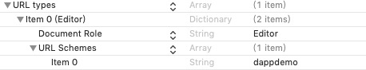

## iOS CocosWallet SDK Access Documentation

### Instructions & Support
- This SDK is used to pull up the CocosWallet wallet and complete the interaction between Dapp and CocosWallet for related action operations.
- The SDK only supports CocosWallet wallets of version 2.1.6 or above.

- Examples Reference Case Walletinvoker Project

### 1. Drag the walletinvoker folder from the Walletinvoker project into your project manually

### 2. Configure URL Schemes,
	- In order for CocosWallet to call back data to its App

- Open the info.plist configuration as follows: (taking dappdemo as an example)




### 3. Initialization
- Initialize in AppDelegate.m file
	- Reference header file #import "CocosWalletApi.h"

- Register URL Schemes in the method `application: didFinishLaunchingWithOptions`
	- [CocosWalletApi registerAppID:@"dappdemo"];

### APIs

#### 1. Authorized Login (CocosLoginObj)

```ruby
     CocosLoginObj *loginObj = [[CocosLoginObj alloc] init];
    loginObj.dappIcon = @"https://ss3.bdstatic.com/70cFv8Sh_Q1YnxGkpoWK1HF6hhy/it/u=1552892908,1688888225&fm=26&gp=0.jpg";
    loginObj.dappName = @"Dapp Test";
    loginObj.desc = @"Description of the requested login";
    [CocosWalletApi sendObj:loginObj];
```

#### 2. Transfer(Transfer)

```ruby
    CocosTransferObj *transfer = [[CocosTransferObj alloc] init];
    transfer.dappName = @"Dapp Test";
    transfer.dappIcon = @"https://timgsa.baidu.com/timg?image&quality=80&size=b9999_10000&sec=1581336823814&di=854974e1a9bf2f774add305a7c0d417c&imgtype=0&src=http%3A%2F%2Fimg.jk51.com%2Fimg_jk51%2F78884959.jpeg";
    transfer.desc = @"Description of the requested transfer";
    transfer.symbol = @"COCOS";
    transfer.to = @"syling1";
    transfer.memo = @"Memo string xxxooo";
    transfer.amount = @"3";
    transfer.from = @"syling";
    [CocosWalletApi sendObj:transfer];
```

#### 3. Contract Call(CocosCallContractObj)

```ruby
    CocosCallContractObj *callContract = [[CocosCallContractObj alloc] init];
    callContract.dappName = @"myDapp";
    callContract.dappIcon = @"https://timgsa.baidu.com/timg?image&quality=80&size=b9999_10000&sec=1581336466306&di=86e0f6afdd435ee39dc57fbf7de11d81&imgtype=0&src=http%3A%2F%2F07.imgmini.eastday.com%2Fmobile%2F20180306%2F20180306_1f79b02260b76a95a2a8dfe68ef9fe10.png";
    callContract.param = @[@(10)];
    callContract.from = @"syling";
    callContract.contract = @"contract.testnumber";
    callContract.method = @"hello";
    callContract.desc = @"Description of the request to call the contract";
    [CocosWalletApi sendObj:callContract];
```


